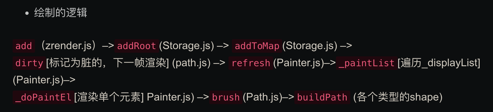

所有图形继承自 Path （Shape - Path - Displayable - Element）

- 好奇 zrender 的事件系统是如何设计的
- 好奇 zrender 的渲染速度为什么这么快，大数据场景为什么不卡顿业务需求，
- 判断一个点是否在某某元素上，目前不知道如何实现
- 官方文档看起来更新不及时，很多的名词解释也不太懂
- 官方例子太少，有一些属性不会用

## [Echarts-ZRender 源码分析（一）](https://zhuanlan.zhihu.com/p/372895633)

ZRender 是 Echarts 的底层图形绘制引擎，它是一个独立发布的基于 Canvas/SVG/VML 的 2D 图形绘制引擎，提供功能：

图形绘制及管理（CRUD、打组）
图形（包含文字）`动画`管理
图形（包含文字）`事件`管理（canvas 中实现 dom 事件）
基于“响应式”（dirty 标记）的高效帧渲染机制
可选择的渲染器机制（Canvas/SVG/VML(5.0 已放弃 VML 支持)）

Tips：图形特指 2D 矢量图型

ZRender 是整体设计思路是面向对象的 MVC 模式，视图层负责渲染，控制层负责用户输入交互，数据层负责数据模型的编排与存储

## [zrender 完全不指北](http://www.zhuazhuaweb.com/zrender/#%E5%AE%98%E6%96%B9%E6%96%87%E6%A1%A3)

## [从论文了解 ECharts 设计与实现](https://zhuanlan.zhihu.com/p/347325932)

## [ECharts 3.0 底层 zrender 3.x 源码分析 1-总体架构](https://zrysmt.github.io/2017/01/11/ECharts%203.0%E5%BA%95%E5%B1%82zrender%203.x%E6%BA%90%E7%A0%81%E5%88%86%E6%9E%901-%E6%80%BB%E4%BD%93%E6%9E%B6%E6%9E%84/)

https://github.com/zrysmt/echarts3/tree/master/zrender

[HTML5 Canvas 绘制的图形的事件处理](https://blog.csdn.net/vuturn/article/details/45822905)

## [echarts 源码解读《一》：zrender 源码概要分析](http://qiuruolin.cn/2019/05/20/echarts-1/)

## [源码解读之 zrender(1)](https://blog.csdn.net/jexxx/article/details/128842947)

## [【ZRender 渲染引擎 - 壹】 | 基础图形元素绘制](https://cloud.tencent.com/developer/article/2145224)

## [Echarts 源码解读 一：zrender 源码分析](https://blog.csdn.net/Lingfur/article/details/120680135)

## [浅谈 Canvas 渲染引擎](https://cloud.tencent.com/developer/article/2240907)
